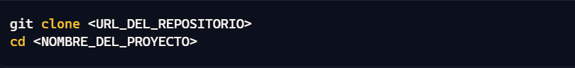
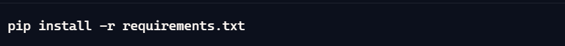
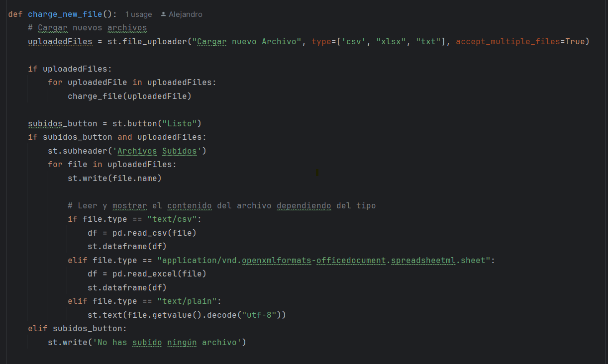
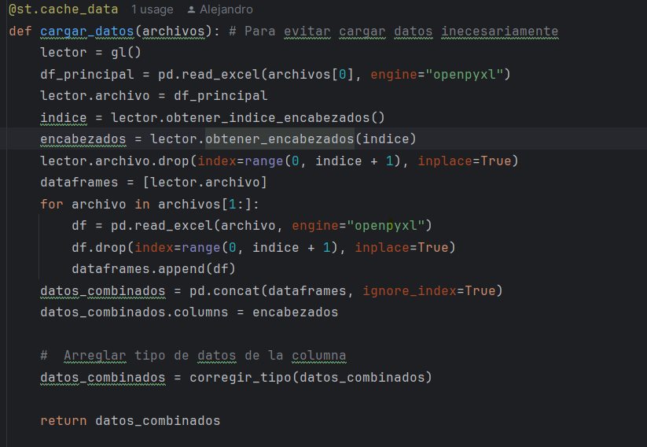
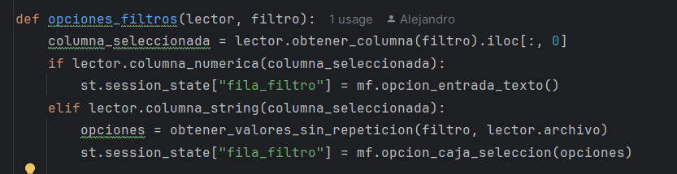
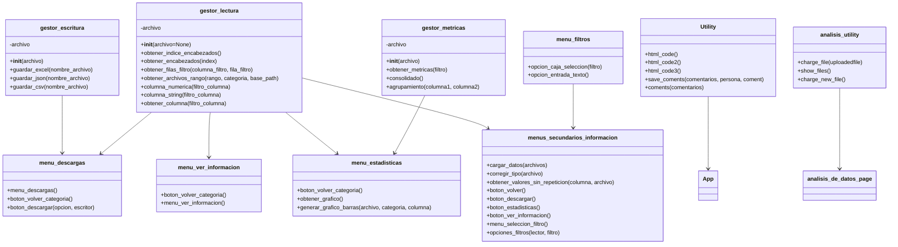

# Manual Técnico: Sistema de Análisis de Datos del SNIES

# LINK DE LA APP https://proyecto-3-pinchetrump-uvteneml9guwk9nbyprjr6.streamlit.app/

## 1. Descripción General

El sistema Nacional de Información de la Educación Superior (SNIES) en Colombia recopila una gran cantidad de datos
sobre lo que son las instituciones de educación superior y los programas académicos que ofrece. Este proyecto permite
analizar datos relacionados con la inscripción, admisión y graduación, ayudando en la toma de decisiones en lo que
concierne al ambito educativo en el presebte documento obtendra detalles sobre a implementacion de as caracteristicas
principales en caso de que desee modificarlo o implementar su propia version

## 2. Estructura del Proyecto

### 2.1 Directorios y Archivos

- **docs/inputs/**: Carpeta que contiene los archivos **xlsx** para el análisis
- **Model/**: Carpeta que contiene los archivos base del programa

## 3. Configuración del Entorno

1. Clonar el repositorio

3. Instalar las dependencias

## 4. Carga de Información

### 4.1 Descripción
Utilizamos funciones de las librerias Streamlit y Os para que el usuario pueda cargar sus propios archivos (Siempre y cuando cumplan con e formato previsto)
### 4.2 Código de Carga de Arhivos

## 5. Filtrado de Información

### 5.1 Busqueda por palabras claves

Los usuarios podrán elegir una columna y en ella a traves de un menu despegable con funcion de busqueda y autocompleto podran filtrar a traves de palabras clave.
### 5.2 Código de filtrado

## 6 Procesamiento de Datos

### 6.1 Descripción

El sistema procesará los datos para calcular, por cada programa y año los datos provinientes de:

- **Estudiantes inscritos**
- **Estudiantes graduados**
- **Estudiantes matriculados**
- **Estudiantes admitidos**
- **Estudiantes matriculados por primera vez**

### 6.2 Código de Procesamiento

### Fin manual tecnico

# UML

## Conlusión

Este manual técnico proporciona una guía detallada para el desarrollo e implementación de una aplicación web interactiva
utilizando Streamlit para el análisis de datos del SNIES. Se describen los pasos necesarios para la carga, filtrado y
procesamiento de la información, lo que permite asegurar que el sistema sea fácil de usar y altamente funcional

